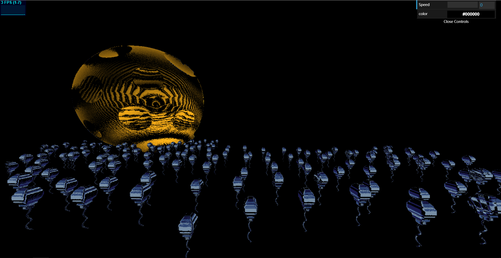
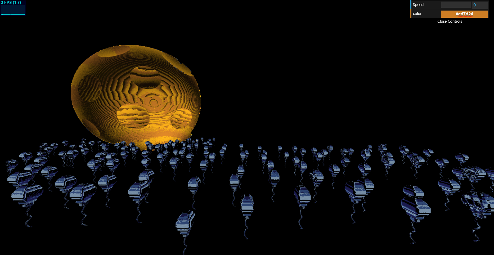

# CIS 566 Homework 2: Implicit Surfaces

## ID
 - __Name:__ Jiangping Xu
 - __PennKey:__ xjp

Citation
----------
[IQ's Article on SDFs](http://www.iquilezles.org/www/articles/distfunctions/distfunctions.htm)

Demo
---------
https://haco77.github.io/hw02-raymarching-sdfs/

Implementation Details
----------
- I use the box's sdf function to create lots of boxs. I write a transform function to transform the objects by transform the casting ray. The object being transform will change in an opposite way(as use the inverse of the transformation matrix). I use that function to put boxs together, and modofy the shape to make them a balloon.
I check the sdf values of the most near boxes. If they are close to each other, I will interpolate the sdf value of the balloon between these two boxes' sdf values. Otherwise I will only use the smallest sdf value of boxes as the final sdf value of balloon. So the boxes are smoothly combined. I add a rope at the bottom and rotate it by its y coordinate and time. So there is animation of rope waving.    

- I mod the coordinate of the ray to create copies of balloons form one. I change the positions of balloons using the transform function I wrote. I increase the y coordinates along the pass of time so balloons are flying. I also calculate a cell coordinates(for each balloon copy) and put it into some noise funcition and then translate the balloon copy based on this value. So now balllons seems to be irregularly positioned. 

- I made a moon by using subtraction between a large sphere and lots of other sphere. I assign the colors of the moon and ballons according to there normals. I animate the color of the moon by time t which is smoothstep-ed. I add gui to control the speed of balloon flying and the color of the moon. 

Scene Shot
---------

Change the color of moon using gui